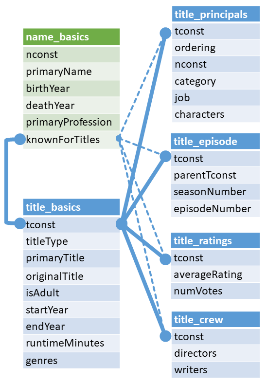
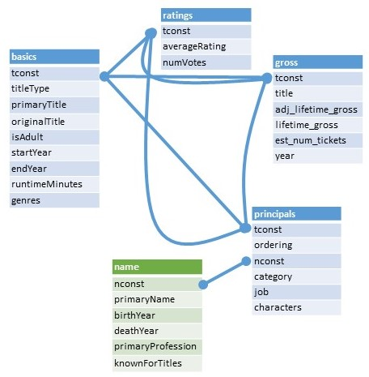
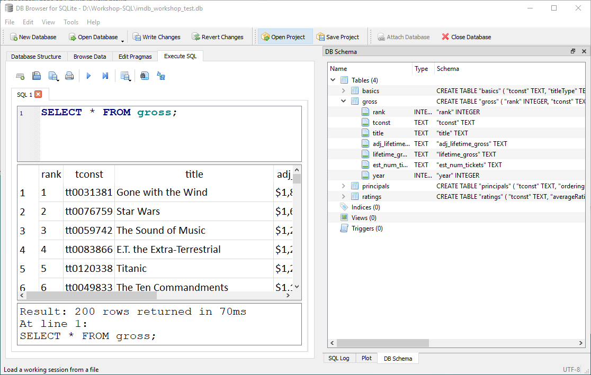

# Intro to SQL for Querying Databases

**This workshop is under development. It should be complete before Nov. 6, 2019.**  The goal is to write a workshop that teaches the basics of (non-spatial) SQL using DB Browsesr and SQLite.

This workshop provides an overview of the utility and base SQL commands for working with data in a relational database. We’ll focus on querying data to get to know a database and answer questions, and combining data from separate tables. 

## Goals
After this workshop learners should be able to:
 * Perform common SQL commands including sorting, filtering, calculating values, aggregating, combining data, and basic data cleaning (i.e. replace missing values).
 * Combine commands to construct a query to answer a specific question.
 * Identify the benefits of working with SQL.
 * Access additional resources for using SQL in other software like R.

## Prerequisites
No prior programming experience is necessary. Bring your laptop with DB Browser installed (https://sqlitebrowser.org/) and running.


# Concepts

## What is a Relational Database?

A database is a set of data in tables that are related to each other in some way. That's it. It's just a collection of tables.

Ideally each table can be connected to another table by a column that both tables have that store the information to match up the rows. This column is called a **key**. A key commonly used on campus is your student or employee ID number.

Let's look at an example dataset of student data with data about courses, grades, and employment.  Can we say anything about the relationship between course grades and employment based on this data?

**Table: Student**

|ID|Name|
|--|--|
|123|Jane Smith|
|456|Maria Martinez|
|789|Paul Jones|

**Table: Courses**

|ID|Course|Grade|
|--|--|--|
|123|Calculus|A-|
|456|Calculus|A|
|789|Calculus|C+|
|123|Data Science|A-|
|456|Data Science|B|
|789|Data Science|B-|

**Table: Employment**

|ID|Position|Employer|HoursPerWeek|
|--|--|--|--|
|123|Student Assistant|University Research Lab|5|
|456|Customer Service|Alumni Center|5|
|456|Research Assistant|University Research Lab|15|
|789|Student Assistant|University Research Lab|10|
|789|Stock Room|Medical Supplier|20|
|789|Customer Service|Alumi Center|15|

## What is SQL?
SQL stands for "structured query language" and it's a language that allows you to ask questions of a database. 

In the above example, it would be much easier to understand the relationships if we build a table aggregating and reshaping our data.  SQL allows us to do that.

### You're Already Doing This!

Researchers typically are already thinking about querying data.  

Imagine you have a table about air quality data.  It contains columns with measurements about various environmental properties such as the temperature, the level of ozone, and perhaps measurements of various particulates.

If you've ever subsetted data in R, for example, you've already done something similar to writing an SQL query! The R code `subset(airquality, Temp > 80, select = c(Ozone, Temp))` becomes `SELECT Ozone, Temp FROM airquality WHERE Temp > 80` in SQL.

In Excel, you might sort your whole spreadsheet on the Temp column, then copy all of the rows that are greater than 80, and paste them into another tab.  You might remove all the other columns except for the Ozone and Temp columns.  You might have also used the cell highlighting tools to change the color of the cells based on the Temp column just to see which cells meet your criteria.

### Why do you want to learn to work with databases and SQL?
 * Efficient
    + Write a few lines of code rather than lots of manual data manipulation
    + SQL is meant for data manipulation
 * Reproducibility 
    + save queries as a record of your workflow
    + re-run code with updates
 * Work with large amounts of data
    + Typically faster to run a process in a database than in a spreadsheet
    + Store lots of data (compare with Excel's row limits)
 * Data management
    + One database file stores many, many tables
    + Write a query instead of making a new files or tabs

### What makes this challenging?
If you currently work in a graphical user interface (GUI), you might be used to being able to see your data, have tools with guided interfaces, and seeing the results of your processing immediately. These aren't things you get with a typical database manager tool, however, you will get used to the typical workflow and seeing everything won't be so necessary.


# Getting Setup

## Install the Software

We'll be using [DB Browser](https://sqlitebrowser.org/), a free, open source, graphical interface for working with SQL databases that works on all major computing operating systems. Installers are available on their [Downloads Page](https://sqlitebrowser.org/dl/).  If you do not have install permissions on your computer, the Portable App version may work without administrator permissions.

## Download the Workshop Data

1. The data is available on [Michele's Workshop Data Box Drive](https://ucdavis.box.com/s/j2paxajpmtsg1ule8zgndy5vckpboex5).  

1. Dismiss the banner that might pop-up at the top of the webpage directing you to log-in (you don't need to log-in or have an account).  

1. Click the *Download* button in the upper right corner to download all the data in one zip.  

1.  Save the data where you can find it easily, then unzip the folder.  You should have 8 files - 7 .csv files and 1 .txt

## Understanding the Data

For this workshop, we'll be working with some data from IMDB (Internet Movie Database). You can get updated data on the [IMDB Datasets Page](https://www.imdb.com/interfaces/#plain). The diagram below outlines the relationships between the data in the tables that make up the database.  Notice how information about the movie and TV show titles is all connected by the ```tconst``` column.  This is a **key**, a unique identifier for each title.  The cast and behind-the-scenes people also have a key - it's called ```nconst```.





I've already pre-processed the data so that it's easier to import into your SQL database and small enough to work reasonably well in a workshop, so if you get new data, you'll have to unzip the downloaded data, and save it as a csv file before proceeding.  The full IMDB database is rather large and growing daily, so feel free to explore it, but know that some of the tables are over 2GB in their original state.

The data we'll be working with is an extract from the IMDB (dataset from Oct. 18, 2019.  Specifically, we'll be looking at the top 200 grossing movie titles and related data.  Here is a diagram of the data we'll be working with:



Notice how all the tables can be connected with the ```tconst``` column.


# Hands On

## Start DB Browser

Start the **DB Browser for SQLite** program in the way you usually start new programs on your computer.  For example, on Windows 10, I typically search for the program name in the search box.

## Create a New Database

First, let's create a new database to store our data.  Remember that a database is like a container that holds related tables.

1. Click on the *New Database* button 

1. Navigate to where you'd like to save your database.  I'd suggest putting it in the folder where you're keeping your workshop data.

1. In the *File name* box, call your database "imdb", and then click *Save*.  You can dismiss the window that pops up to *Edit table definition*.  We'll load data in a different way.

Now we have an empty database called *imdb.db*.


## Import the Data into a Database

Let's load the first data table:

1. From the *File* menu, select *Import*, and then *Table from CSV...*.

1. Navigate to where you saved your workshop data and select *basics.csv* and click the *Open* button.  A new dialog window should pop up now.

1. In the *Table name* field, you can change your table name. This is handy because if your data file is named something complicated, you can name it something easier to type here. Let's leave the name as *basics*.

1. Check the box next to *Column names in first line* because our data has headers.

1. Notice that the preview of the table does not look right.  The column names are not what we would expect for a table of information about actors.  Change the *Field separator* drop-down menu to *Tab*.  Notice the change in the preview.  That looks better!

1. Change the *Quote character* to the blank space on the drop-down menu. The quotes that appear in the data do not indicate that something is text, but rather are used in a more literary sense.  If we don't change this, our data import will fail (your instructor learned this from personal experience).

1. We can leave the *Encoding* as UTF-8.  Note: when you load your own data, if you get odd characters in your preivew, check to see what your character encoding should be.  *Trim fields* removes extra spaces.

1. Click the *OK* button when everything looks as you would expect.

Repeat the process with the *gross.csv*, *principals.csv*, and *ratings.csv* files.  

### The DB Browser Interface

DB Browser has a number of tabs and tools to help you interact with your data.  We'll be mainly working with the *Execute SQL* tab, so go ahead and click on that tab.  We'll write our queries in the top portion of the interface, the results will be returned to the middle pannel, and messages will return to the bottom portion.

Notice also the *DB Schema* panel on the right side of the window.  It should show all of the tables you've added.  If you click on the > symbol next to the table name, the interface will expand a list of the columns in your table.




## Viewing Data

### Anatomy of a SELECT Statement

We're ready to write our first queries! The most common query you'll use is the SELECT statement.  In it's most basic form, it shows you the data in a table, but you can add option to customize the view you get back.  Let's try!  Type this query into the query box:

```SELECT * FROM gross;```

Now click the *Execute all* button. 

This query ask the database to select everything (* means "everything") from the table gross.  It ends with a semicolon to tell the database that this is the end of our request.  

```
SELECT 
* 
FROM 
gross;
```
The above query does exactly the same thing as the first one, hence the need for the end of query indicator.  We can use new lines to help us organize large queries to make them easier to read.

Capitolization in queries follows some general rules:

* Commands are in all caps

* Table names and column names are all lowercase

Will the query work if you don't do this? It depends on the interface you're using, but generally it will work.  DB Browser doesn't mind either way.  In the text of this workshop, I will try to be consistent and use the proper form.

### Selecting Columns

What if we don't want to see all of the columns in the table?  We can ask for just the columns we want to see.  Let's get the title, the year the movie came out, and the ajusted lifetime gross income:

```
SELECT title, year, adj_lifetime_gross 
FROM gross;
```

### Ordering Results

What if I want to see them in order of the year they were made?

```
SELECT title, year, adj_lifetime_gross 
FROM gross
ORDER BY year;
```

**CHALLENGE:** How would I order the table by the adjusted lifetime gross income?

The default order by option sorts in ascending order.  We can sort in descending order to get the top grossing movies first by adding the DESC parameter:

```
SELECT title, year, adj_lifetime_gross 
FROM gross
ORDER BY adj_lifetime_gross DESC;
```

### Limiting Number of Rows

Our database has the top 200 movies.  What if we just want a table of the top 10?  We can use the *LIMIT* command to reduce the number of rows the query returns.

```
SELECT title, year, adj_lifetime_gross 
FROM gross
ORDER BY adj_lifetime_gross DESC
LIMIT 10;
```

### Calculating Values

Let'd investigate the earnings of these movies.  In their current state, the numbers in the *adj_lifetime_gross* column are hard to compare.  

**CHALLENGE:** Can you build a query that shows only the *title*, *year* and *adj_lifetime_gross* columns from the *gross* table?

We can add mathematical operators and numbers to the column name to perform the calculation.  Let's calculate the adjusted lifetime gross column in billions of dollars (9 zeros):

```
SELECT title, year, adj_lifetime_gross/1000000000
FROM gross;
```

### Renaming/Aliasing Columns

Doing calculations is helpful for visualizing data, but the default column name is not always easy to read or interpret.  We can rename columns in the text of our query.  This is handy if you're planning to export this table for future use, especially if you're sending it to someone else.  Let's rename our calculated column using the *AS* option.

```
SELECT title, year, adj_lifetime_gross/1000000000 AS gross_billions
FROM gross;
```


### Unique Values

In your data exploration, you might want to know which categories you're working with if you have a categorcal variable.  Let's look at the *principals* table which contains the roles played in each movie.

**REVEIW** How would you see all the data in the *principals* table?  I'll typically view all the data (adding a LIMIT parameter if it's a big one) before I write queries just to get a better feel for the information that's contained there.

I'm curious about how many different roles are used in the *category* field.

```
SELECT DISTINCT(category) 
FROM principals;
```

*DISTINCT* is a function that we can run on a column.  In this case, the function returns a list of unique values from the column, so each item is only listed once.


### Filtering Results

Now that we know what kinds of job rolls are listed in the *principals* table's *category* field, let's filter the table to look at the records for just one job type.

```
SELECT * 
FROM principals
WHERE category LIKE 'actor';
```

The *WHERE* option lets us specify a condition of the record to filter on.  (For you spatially-minded folks, *WHERE* does not inherently mean a location.)

What does *LIKE* mean?  Why not use = ? For text-based data (non-numeric data), the comparison operators are different.  You can think of *LIKE* for text as being about the same as = for numeric data.

The above query returns just the actors, so male people in an acting role.  By now, you probably can figure out how to get filter for actresses, or female people in an acting role, BUT how can we get both?  We can ask *WHERE* to meet multiple conditions using either *OR* (for where a record can match either of two conditions) or *AND* (when a record must match both conditions).  Let's get both actors and actresses:

```
SELECT * 
FROM principals
WHERE 
category LIKE 'actor' 
OR category LIKE'actress';
```

There is another way to do this query.  Because our categories are similar, we can use a wildcard - *%* in SQL - to indicate that we want to match the beginning of the word, but the end is allowed to vary.  Let's take a look:

```
SELECT * 
FROM principals
WHERE 
category LIKE 'act%';
```

You can also use the wildcard character at the beginning of the word as well.  We'll use a *WHERE* clause a lot later so we'll leave this topic for now.


## Aggretating Data

We've just looked a number of ways to filter data, but now let's look at some ways to aggregate data

### Count

It probably won't surprise you that we can count the number of records or that this particular query returns the number 200:

```
SELECT COUNT(tconst) 
FROM ratings;
```

You might also suspect that you can add *WHERE* clause to this to get more information.  Let's see how many movies in our dataset are rated better than or equal to 8.0:

```
SELECT COUNT(tconst) 
FROM ratings
WHERE averageRating >=8.0;
```

We could also find out how many are greater than or equal to 8.0 but less than 8.5 using an *AND*:

```
SELECT COUNT(tconst) 
FROM ratings
WHERE averageRating >=8.0 AND averageRating < 8.5;
```


AVG

SUM

Group By

Having

## Saving Queries

Create View

Create Table

## Joins

Basic Joins

Join/On vs. Where

Join types... left, right, inner, etc.... which are allowed with this tool?

## Data Management

Update Table Where...

Add column

Update column

Drop tables


# Resources

[Sofware Carpentry's SQL Novice Workshop](http://swcarpentry.github.io/sql-novice-survey/)

[Clark Fitzgeralds & Nick Ulle's SQL Workshop](https://github.com/clarkfitzg/SQLworkshop)

[Michele Tobias' Spatial SQL Workshop](https://github.com/MicheleTobias/Spatial_SQL)

[W3Schools SQL Materials](https://www.w3schools.com/sql/default.asp) - This is an excellent reference for SQL syntax with a fun "try it yourself" feature.
